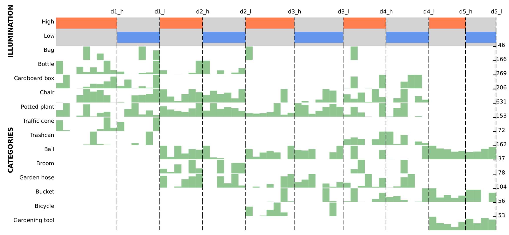

# TiROD: Tiny Robotics Dataset and Benchmark for Continual Object Detection

<div align="center">

</div>

## Abstract
This is the official website for the TiROD dataset and benchmark.

Detecting objects in mobile robotics is crucial for numerous applications, from autonomous navigation to inspection.
However, robots are often required to perform tasks in different domains with respect to the training one and need to adapt to these changes.
Tiny mobile robots, subject to size, power, and computational constraints, encounter even more difficulties in running and adapting these algorithms.
Such adaptability, though, is crucial for real-world deployment, where robots must operate effectively in dynamic and unpredictable settings.
In this work, we introduce a novel benchmark to evaluate the continual learning capabilities of object detection systems in tiny robotic platforms. Our contributions include: 

-  Tiny Robotics Object Detection~(TiROD), a comprehensive dataset collected using a small mobile robot, designed to test the adaptability of object detectors across various domains and classes;
-  an evaluation of state-of-the-art real-time object detectors combined with different continual learning strategies on this dataset, providing detailed insights into their performance and limitations;
-  moreover, we publish the data and the code to replicate the results to foster continuous advancements in this field.
Our benchmark results indicate key challenges that must be addressed to advance the development of robust and efficient object detection systems for tiny robotics.

## 📹 Dataset Video
Check out the demo video of the dataset (click the image):

[](https://www.youtube.com/watch?v=e76m3ol1i4I)

## 📊 Dataset Information

| Attribute        | Description                                              |
|------------------|----------------------------------------------------------|
| **Name**         | TiROD                                                    |
| **Size**         | 2 GB                                                     |
| **Number of Images** | 6.7K                                                 |
| **Number of Classes** | 13                                                  |
| **Number of BBoxes** | 17.9K                                                |
| **Data Format**  | png                                                      |
| **Annotations**  | COCO format                                              |
| **Download Link**| [Download Dataset](coming_soon)                          |

The distribution of labels across different tasks can be observed in the following figure.

---

## 💻 Data Preview
Here are some example frames from each of the 10 CL tasks:

<div align="center">

</div>

## 🧑‍💻 Download the data

Download the dataset from this [link](coming-soon)

📂 Folder Structure:

```
TiROD/
├── Domain1/
│   ├── High
│   │   ├── annotations
│   │   │   ├── train.json
│   │   │   ├── val.json
│   │   │   ├── test.json
│   │   ├── images
│   │   │   ├── train
│   │   │   │   ├── frame1.png
│   │   │   │   ├── ...
│   │   │   ├── val
│   │   │   │   ├── ...
│   │   │   ├── test
│   │   │   │   ├── ...
│   ├── Low
│   │   ├── ...
├── ...
└── docs/
    └── README.md
```

## TiROD Benchmark results

Results for the implementation of **NanoDet Plus**

| Method               | Ω ↑  | RSD ↑ | RPD ↑ |
|----------------------|------|-------|-------|
| Fine-Tuning           | 0.19 | 0.19  | 0.99  |
| LWF                  | 0.24 | 0.27  | 0.95  |
| IncDet               | 0.20 | 0.27  | 0.99  |
| SID                  | 0.27 | 0.44  | 0.86  |
| Replay               | 0.63 | 0.70  | 0.95  |
| Temporal Replay      | 0.48 | 0.54  | 0.96  |
| K-Means Replay       | **0.65** | **0.75** | **0.99** |
| Latent Distillation  | 0.26 | 0.38  | 0.69  |
| Latent Replay        | 0.62 | 0.67  | 0.91  |
| **Joint Training [mAP]** |  **0.66 %**  |

To replicate the results, clone this [repository](https://github.com/pastifra/TiROD_code) and follow the instructions of the Readme.md

## Citation

If you find this project useful in your research, please add a star and cite us 😊 

```BibTeX
@misc{pasti2024TiROD,
    title={Tiny Robotics Dataset and Benchmark for Continual Object Detection},
    author={Francesco Pasti, Riccardo De Monte, Davide Dalle Pezze, Gian Antonio Susto, Nicola Bellotto},
    year={2024}
}
```

****

## Related works

```BibTeX
@inproceedings{pastiLD,
  title={Latent Distillation for Continual Object Detection at the edge.},
  author={Pasti, Francesco and Ceccon, Marina and Dalle Pezze, Davide and Paissan, Francesco and Farella, Elisabetta and Susto, Gian Antonio and Bellotto, Nicola},
  booktitle={European conference on computer vision},
  year={2024},
}
```
[https://github.com/pastifra/Continual_Nanodet](https://github.com/pastifra/Continual_Nanodet)

## Thanks

[https://github.com/RangiLyu/nanodet](https://github.com/pastifra/Continual_Nanodet)


