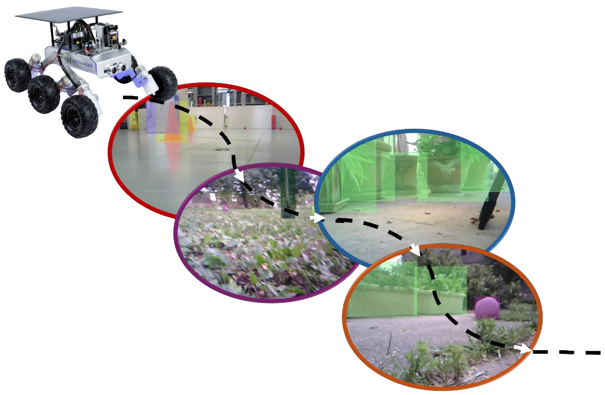

# TiROD: Tiny Robotics Dataset and Benchmark for Continual Object Detection



---

## Overview

**TiROD** is a benchmark to evaluate the performances of Continual Learning for Object Detection algorithms based on the data collected by a tiny robot rover.
We define 10 distinct CL tasks, characterized by the 5 different environments explored by the robot and the two illumination conditions. The tasks range from d1_h (read Domain 1, High illumination) to d5_l (Domain 5, Low illumination). The first two tasks correspond to an indoor environment, while the remaining ones are outdoor.

TiROD addresses the challenges of both Domain Incremental and Class Incremental Learning, requiring CLOD systems to adapt to domain shifts and varying data distributions.
Moreover, by capturing the data with a low-cost sensor of the Tiny Robot, TiROD raises additional challenges that must be addressed in real-world tiny robotics scenarios such as noise and motion blur in the images.

---

## 📊 Dataset Information

| Attribute        | Description                                              |
|------------------|----------------------------------------------------------|
| **Name**         | TiROD                                                    |
| **Size**         | 2 GB                                                     |
| **Number of Images** | 6.7K                                                 |
| **Number of Classes** | 13                                                  |
| **Number of BBoxes** | 17.9K                                                |
| **Data Format**  | png                                                      |
| **Annotations**  | COCO format                                              |
| **Download Link**| [Download Dataset](coming_soon)                          |

The distribution of labels across different tasks can be observed in the following figure.

---

## 🔍 Features

- **Multiple ** from various sources.
- **Cleaned and pre-processed** for immediate use.
- Contains **real-world use cases** in machine learning.
- High-quality metadata and labels for every data point.

---

## 💻 Preview

### Image Example 1


### Image Example 2


---

## 📹 Demo Video

Check out the demo video of the dataset in use:

[](https://www.youtube.com/watch?v=VIDEO_ID)

---

## 🧑‍💻 Usage Instructions

To use this dataset, follow the steps below:

1. Download the dataset from the [link provided](https://example.com/download).
2. Import the dataset into your preferred programming language or tool.
3. Use the following code snippet to load the dataset in Python:

    ```python
    import pandas as pd
    dataset = pd.read_csv("path/to/dataset.csv")
    print(dataset.head())
    ```

4. For detailed documentation, check out the [documentation page](https://example.com/docs).

---

## 📂 Folder Structure

```plaintext
dataset/
├── images/
│   ├── image1.png
│   ├── image2.png
├── data/
│   ├── dataset.csv
│   └── metadata.json
└── docs/
    └── README.md
